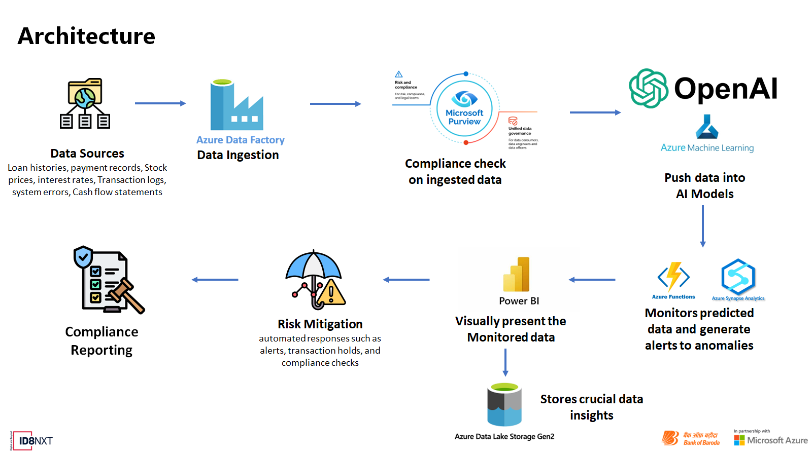

# RiskShield AI

Please find detailed solution at : [Link to PPT]

## Overview

RiskShield AI is a comprehensive, AI-powered risk management platform designed to enhance the Bank of Baroda's ability to predict, assess, and mitigate credit, operational, market, and liquidity risks in real-time. Leveraging Microsoft Azure OpenAI and other Azure tools, this solution provides predictive insights and actionable risk mitigation strategies, ensuring regulatory compliance and safeguarding the bank's financial health.

## Key Features

1. **Risk Prediction**

   - Utilize Azure OpenAI to develop models that predict potential credit defaults, market volatility, and operational disruptions.
   - Incorporate historical data, market trends, and customer behavior patterns.

2. **Risk Assessment**

   - Use AI to continuously monitor and assess the risk levels of various assets, transactions, and customer portfolios.
   - Develop real-time risk assessment dashboards using Power BI.

3. **Risk Mitigation**

   - Implement automated workflows to trigger mitigation strategies for identified risks.
   - Integrate with Azure Logic Apps to automate responses like alerts, transaction holds, and compliance checks.

4. **Regulatory Compliance**
   - Ensure adherence to regulatory standards by automating compliance checks and audits.
   - Use AI to generate compliance reports and identify potential regulatory breaches.

## Architecture

## Data Collection and Processing

- **Credit Risk Data:** Loan histories, payment records, credit scores, customer demographics.
- **Market Risk Data:** Stock prices, interest rates, commodity prices, economic indicators.
- **Operational Risk Data:** Transaction logs, system error reports, fraud detection systems.
- **Liquidity Risk Data:** Cash flow statements, deposit/withdrawal records, short-term liabilities.

Data is stored and managed using Azure Data Lake. Data ingestion services are deployed on Azure Service Fabric to ensure scalability and reliability.

## AI Model Development

- **Models Used:**
  - Credit Risk Prediction: Logistic Regression, Gradient Boosting.
  - Market Risk Prediction: Time Series Analysis, ARIMA models.
  - Operational Risk Detection: Anomaly Detection models, Neural Networks.
  - Liquidity Risk Prediction: Regression models, Time Series Forecasting.

Models are developed using Azure OpenAI and trained/deployed using Azure Machine Learning.

## Real-Time Monitoring and Alerting

- **Workflows:** Automated using Azure Logic Apps.
- **Dashboards:** Created with Power BI for real-time visualization of risk levels.
  - **Credit Risk Dashboard:** Displays potential defaults, risk scores.
  - **Market Risk Dashboard:** Shows market volatility indicators, portfolio risk.
  - **Operational Risk Dashboard:** Highlights detected anomalies and operational issues.
  - **Liquidity Risk Dashboard:** Monitors cash flow status, short-term liabilities.

Alerts are generated based on predefined thresholds and real-time data analysis.

## Scalability and Maintenance

- **Scalability:** Designed to handle terabytes of data using Azure's scalable infrastructure.
- **Deployment:** Simplified with Azure's integrated services.
- **Maintenance:** Automated CI/CD pipelines and monitoring ensure the system is up-to-date and efficient.

## Security Considerations

- **Data Encryption:** All data is encrypted at rest and in transit.
- **Access Controls:** Role-based access controls ensure only authorized users can access sensitive information.
- **Compliance:** Regular audits and compliance checks are automated to ensure adherence to regulatory standards.

## Business Potential and Relevance

RiskShield AI has significant business applications, including:

- Enhancing financial stability by proactively managing risks.
- Building customer trust through robust risk management practices.
- Ensuring regulatory compliance to avoid penalties and reputational damage.

## Uniqueness of Approach and Solution

- **Generative AI Integration:** Utilizes advanced AI models for accurate risk predictions.
- **Real-Time Monitoring:** Continuous monitoring and real-time alerts ensure immediate response to potential risks.
- **Comprehensive Coverage:** Addresses multiple risk types (credit, market, operational, liquidity) within a unified platform.
- **Scalable Architecture:** Designed to scale with the bank’s growth, ensuring sustained performance and reliability.

## User Experience

**Stakeholder Benefits:**

- **Bank Management:** Real-time insights and automated risk mitigation strategies enable informed decision-making.
- **Risk Managers:** Detailed dashboards and alerts provide actionable information to manage risks proactively.
- **Regulatory Bodies:** Automated compliance checks and reports ensure adherence to regulatory standards.
- **Customers:** Enhanced risk management translates to a more stable and reliable banking experience.

## How Far It Can Go

- **Scalability:** The concept is designed to be scalable, leveraging cloud infrastructure to handle increasing data volumes and complexity.
- **Global Impact:** Potential to be implemented across various banks and financial institutions worldwide, adapting to different regulatory environments.
- **Future Enhancements:** The solution can evolve to incorporate more sophisticated AI techniques, additional risk types, and tighter integration with other banking systems.
